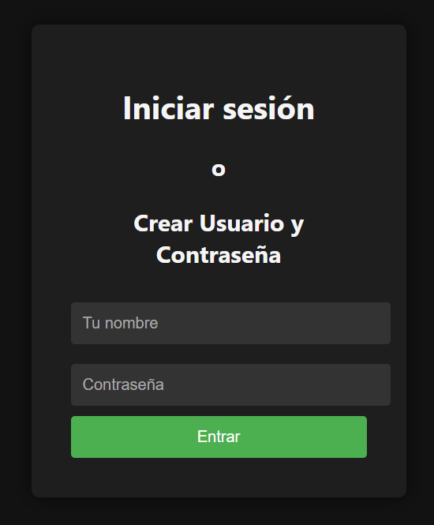
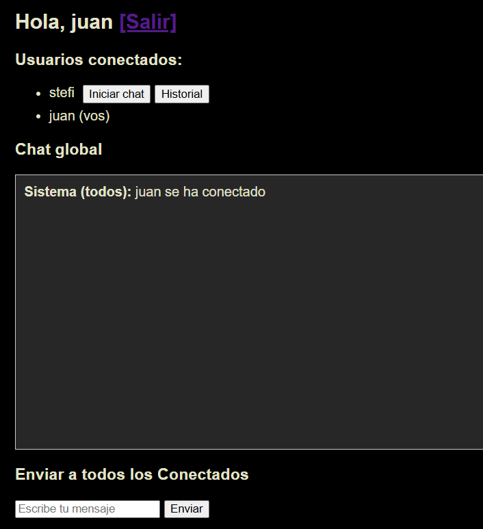
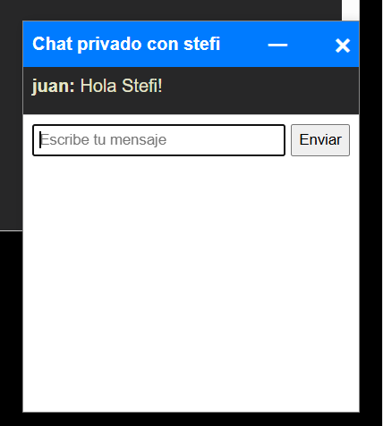
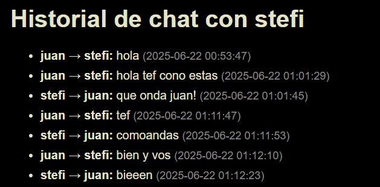

🌐 **Leer en otro idioma:** [English](README.md)

# 💬 Aplicación de Chat en Tiempo Real

## 💼 Sobre este proyecto

Este proyecto es una aplicación de chat en tiempo real desarrollada con **Flask** y **Socket.IO**, que permite la comunicación entre múltiples usuarios, mensajería privada y almacenamiento persistente del historial.

Demuestra la integración de comunicación en tiempo real con una arquitectura backend escalable, combinando **MySQL** para persistencia de datos, **Redis** para manejo de sesiones y mensajería, y **Nginx** como proxy inverso.

El sistema está completamente containerizado con Docker, facilitando su despliegue y ejecución.

---

## 📌 Descripción general

La aplicación permite:

* Unirse a un entorno de chat compartido
* Enviar y recibir mensajes en tiempo real
* Iniciar conversaciones privadas
* Guardar historial de mensajes en base de datos

---

## 📸 Capturas del sistema

### 🔐 Login



---
### Pantalla principal



---

### 💬 Chat en tiempo real



---

### 📜 Historial de conversaciones



---

## 🏗️ Arquitectura

```
             +-----------------+
             |     NGINX       |
             |    (Port 80)    |
             +--------+--------+
                      |
               Proxy to port 5000
                      |
             +--------v--------+
             |      Web        |
             | Flask + Socket  |
             |  (Port 5000)    |
             +--------+--------+
                      |
          +-----------+------------+
          |                        |
  +-------v------+         +-------v------+
  |    MySQL     |         |    Redis     |
  |  (Port 3306) |         |  (Port 6379) |
  +--------------+         +--------------+
```

---

## ⚙️ Componentes del sistema

### 🌐 Nginx

* Actúa como proxy inverso
* Redirige tráfico HTTP y WebSocket hacia Flask

### 🧠 Flask + Socket.IO

* Maneja rutas HTTP (login, chat, historial)
* Gestiona la comunicación en tiempo real
* Corre en el puerto 5000

### 🗄️ MySQL

* Almacena usuarios y mensajes
* Garantiza persistencia de datos

### ⚡ Redis

* Maneja sesiones de usuario
* Actúa como broker Pub/Sub
* Permite escalar la comunicación en tiempo real

---

## 🧩 Servicios

* **web**: Aplicación Flask con Socket.IO
* **mysql**: Base de datos inicializada con `init.sql`
* **redis**: Sistema de cache y mensajería
* **nginx**: Proxy inverso

Todos los servicios se ejecutan dentro de la red `chat-network`.

---

## 🚀 Funcionalidades

* Mensajería en tiempo real con WebSockets
* Chat público y privado
* Historial persistente
* Soporte multiusuario
* Arquitectura escalable con Redis
* Entorno containerizado con Docker

---

## 🛠️ Tecnologías utilizadas

**Backend**

* Python (Flask)
* Flask-SocketIO

**Infraestructura**

* Docker / Docker Compose
* Nginx

**Base de datos y cache**

* MySQL
* Redis

---

## ⚙️ Instalación y ejecución

### 🔧 Requisitos

* Docker
* Docker Compose

---

### 📥 Instalación

Clonar el repositorio:

```bash
git clone https://github.com/StefiVergini/chat-StefaniaVergini.git
cd chat-StefaniaVergini
```

---

### ▶️ Ejecutar la aplicación

```bash
docker-compose up --build
```

---

### 🌐 Acceso

Abrir en el navegador:

```
http://localhost
```

---

## 🔐 Uso

* Ingresar un usuario y contraseña
* Si el usuario no existe, se crea automáticamente
* Una vez dentro se puede:

  * Ver usuarios conectados
  * Enviar mensajes públicos
  * Iniciar chats privados

---

## 💡 Puntos destacados de arquitectura

* Separación de responsabilidades mediante servicios
* Comunicación en tiempo real con WebSockets
* Redis como broker para escalabilidad
* Nginx como proxy inverso
* Entorno completamente containerizado

---

## 👩‍💻 Autor

**Stefanía Vergini**
Full-Stack Developer

---

## 📬 Contacto

stefanialvergini@gmail.com
Abierta a nuevas oportunidades y colaboraciones

