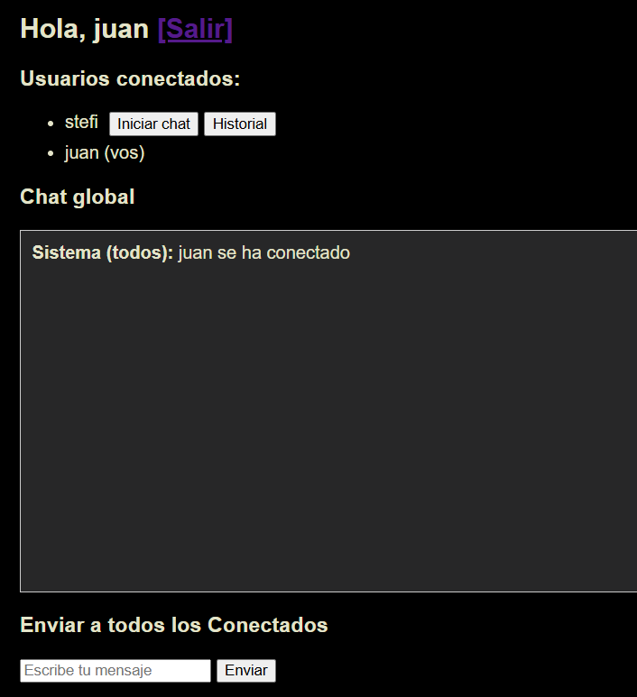
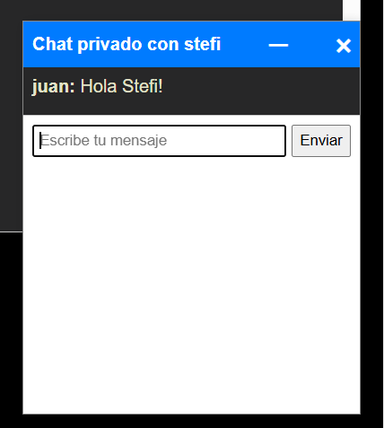
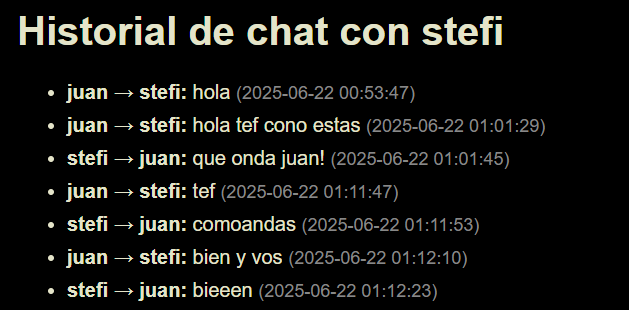

# Chat-StefaniaVergini: Aplicación de Chat en Tiempo Real

## Descripción

Este proyecto es una aplicación de chat en tiempo real desarrollada con Flask y Socket.IO, que permite la comunicación entre múltiples usuarios, mensajes privados, y almacenamiento de historial. La arquitectura incluye base de datos MySQL, Redis para manejo eficiente de sesiones Socket.IO, y Nginx como proxy inverso.

---

## Arquitectura

                 +-----------------+
                 |    NGINX        |
                 |  (Port 80)      |
                 +--------+--------+
                          |
                          |
                   Proxy to port 5000
                          |
                 +--------v--------+
                 |     Web         |
                 | Flask + Socket  |
                 | (Port 5000)     |
                 +--------+--------+
                          |
              +-----------+------------+
              |                        |
      +-------v------+         +-------v------+
      |    MySQL     |         |    Redis     |
      |  (Port 3306) |         |  (Port 6379) |
      +--------------+         +--------------+

- Entrada al Sistema:
    Los clientes acceden a través de NGINX en el puerto 80
    NGINX redirige tanto tráfico HTTP como WebSocket al servidor Flask

- Servidor Web
    Flask maneja las rutas web estándar (login, chat, history)
    Socket.IO gestiona la comunicación en tiempo real
    Opera en el puerto 5000 dentro del contenedor

- Almacenamiento y Cache
* MySQL (puerto 3306):
    Almacena usuarios y mensajes permanentemente
    Maneja toda la persistencia de datos
* Redis (puerto 6379):
    Gestiona sesiones de usuario
    Actúa como broker para la comunicación Pub/Sub (conexión persistente) de Socket.IO
    Facilita la comunicación entre múltiples instancias del servidor

### Servicios:

- **web**: Aplicación Flask que implementa el frontend y backend del chat. Usa Flask-SocketIO con Redis.
- **mysql**: Base de datos que almacena usuarios, mensajes y sesiones. Se inicializa con `init.sql`.
- **redis**: Sistema de cache utilizado para manejar las conexiones en tiempo real de Socket.IO.
- **nginx**: Proxy inverso que enruta el tráfico HTTP hacia el servicio web.

Todos los servicios se comunican dentro de la red `chat-network`.

---

## Requisitos

- Docker
- Docker Compose

---

## Instrucciones

1. Cloná este repositorio:

   git clone https://github.com/StefiVergini/chat-StefaniaVergini.git
   cd chat-StefaniaVergini

2. Iniciá los contenedores:

    docker-compose up --build

3. Accedé a la aplicación desde el navegador:

    Navegá a http://localhost

4. Ingresá un nombre de usuario (no puede haber dos usuarios iguales) en el login y     contraseña. 
    Si es el primer ingreso, se creará tu usuario desde la misma pantalla.
    [Ejemplo: usuario 'juan' y contraseña: '1234']

5. Al acceder, visualizá los usuarios conectados, enviá mensajes públicos o iniciá chats privados.
    
    

6. Visualizá el historial de conversación de los usuarios conectados.
    