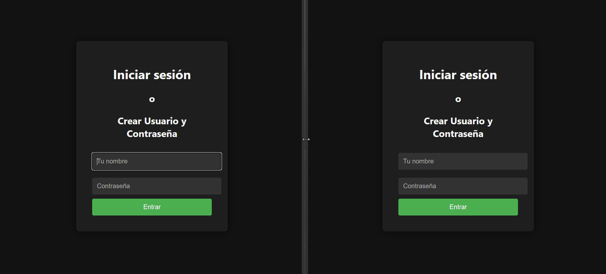

🌐 **Read this in other language:** [Español](README.es.md)

# 💬 Real-Time Chat Application

## 🎬 Demo


## 💼 About This Project

This project is a real-time chat application developed using **Flask** and **Socket.IO**, supporting multiple users, private messaging, and persistent chat history.

It demonstrates a scalable backend architecture using **MySQL**, **Redis**, and **Nginx**, fully containerized with Docker.

---

## 📌 Overview

The application allows users to:

- Join a shared chat environment  
- Send and receive real-time messages  
- Start private conversations  
- Persist chat history  

---

## 📸 Screenshots

### 🔐 Login


---
### Main Screen


---

### 💬 Real-Time Chat


---

### 📜 Chat History


---


## 🏗️ Architecture

```
             +-----------------+
             |     NGINX       |
             |    (Port 80)    |
             +--------+--------+
                      |
               Proxy to port 5000
                      |
             +--------v--------+
             |      Web        |
             | Flask + Socket  |
             |  (Port 5000)    |
             +--------+--------+
                      |
          +-----------+------------+
          |                        |
  +-------v------+         +-------v------+
  |    MySQL     |         |    Redis     |
  |  (Port 3306) |         |  (Port 6379) |
  +--------------+         +--------------+
```

---

## ⚙️ System Components

### 🌐 Nginx

* Acts as a reverse proxy
* Routes HTTP and WebSocket traffic to the Flask application

### 🧠 Flask + Socket.IO

* Handles HTTP routes (login, chat, history)
* Manages real-time communication between clients
* Runs on port 5000 inside the container

### 🗄️ MySQL

* Stores users and chat messages
* Ensures persistent data storage

### ⚡ Redis

* Manages user sessions
* Acts as a Pub/Sub broker for Socket.IO
* Enables scalable real-time communication

---

## 🧩 Services

* **web**: Flask application with Socket.IO
* **mysql**: Database initialized with `init.sql`
* **redis**: Cache and message broker
* **nginx**: Reverse proxy

All services run within a shared Docker network.

---

## 🚀 Features

* Real-time messaging using WebSockets
* Private and public chat support
* Persistent chat history
* Multi-user environment
* Scalable architecture with Redis Pub/Sub
* Containerized setup with Docker Compose

---

## 🛠️ Tech Stack

**Backend**

* Python (Flask)
* Flask-SocketIO

**Infrastructure**

* Docker / Docker Compose
* Nginx

**Database & Cache**

* MySQL
* Redis

---

## ⚙️ Installation & Setup

### 🔧 Requirements

* Docker
* Docker Compose

---

### 📥 Installation

Clone the repository:

```bash
git clone https://github.com/StefiVergini/chat-StefaniaVergini.git
cd chat-StefaniaVergini
```

---

### ▶️ Run the application

```bash
docker-compose up --build
```

---

### 🌐 Access

Open your browser and go to:

```
http://localhost
```

---

## 🔐 Usage

* Enter a username and password
* If the user does not exist, it will be created automatically
* Once logged in, you can:

  * View connected users
  * Send public messages
  * Start private chats

---

## 💡 Architecture Highlights

* Separation of concerns using microservices
* Real-time communication handled via WebSockets
* Redis used for horizontal scalability and session handling
* Reverse proxy setup with Nginx
* Fully containerized environment

---

## 👩‍💻 Author

**Stefanía Vergini**
Full-Stack Developer

---

## 📬 Contact

stefanialvergini@gmail.com Open to new opportunities and collaborations
